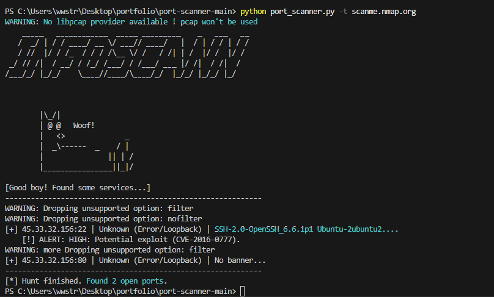

# InfoScann - Escáner de Puertos en Python


**InfoScann** es un escáner de puertos de red rápido, modular y concurrente desarrollado íntegramente en Python.

El proyecto está diseñado para realizar tareas de reconocimiento de red eficaces (como banner grabbing y estimación del sistema operativo), aprovechando un modelo de paralelismo asíncrono y manipulación de paquetes directos de bajo nivel.

## Arquitectura y Lógica del Código

La lógica del script base (`port_scanner.py`) se divide en tres fases principales que ocurren secuencialmente por cada puerto analizado:

1. **Paralelismo y Conexión Base**: Para asegurar que la herramienta sea rápida al escanear múltiples direcciones IP y puertos a la vez, he implementado `concurrent.futures.ThreadPoolExecutor`. En lugar de iterar puerto por puerto en un bucle bloqueante, el programa despacha y gestiona un "pool" de hilos que realizan pruebas en paralelo. La detección en sí ocurre utilizando abstracciones de bajo nivel con la librería estándar `socket` (método `connect_ex`).
2. **Banner Grabbing Activo**: Cuando el escáner detecta que el puerto de un objetivo ha aceptado la conexión en el paso previo, inmediatamente intenta capturar la respuesta del servicio (*banner*). Para servicios web en ciertos puertos (como 80, 443, 8080), el código inyecta manualmente una petición HTTP simple (`HEAD / HTTP/1.1`) para forzar una respuesta identificable por parte del servidor remoto.
3. **OS Fingerprinting (Estimación de SO)**: El componente más avanzado de la aplicación utiliza la librería `scapy` para crear paquetes puros y analizar de vuelta el "Time-To-Live" (TTL) en la respuesta TCP del objetivo. A través de este sencillo cálculo en las capas inferiores del modelo OSI, la herramienta infiere de manera educada contra qué Sistema Operativo estamos enfrentándonos (ej. TTL~64 apunta a distribuciones Linux, TTL~128 apunta a Windows).

## Librerías Utilizadas

- `socket`: Empleada para instanciar las conexiones TCP/IP de más bajo nivel.
- `concurrent.futures`: Para la orquestación, asincronía y el control del volumen de hilos de ejecución.
- `scapy`: Utilizada para el análisis de paquetes de red "en crudo" (raw packets).
- `argparse`: Integra parámetros de entrada al ejecutar el script en consola para mantener un estándar POSIX.
- `ipaddress`: Parsea e identifica un simple número IP de manera robusta y permite el desglose de subredes completas (CIDR blocks).
- `pyfiglet`: Como añadido estético temporal para invocar una interfaz inicial agradable por terminal.

## Requisitos e Instalación

Para que todas las características de la herramienta funcionen al 100% se requiere la siguiente preparación del entorno:

**Requisitos Previos:**
- **Python 3.8** o superior.
- **Windows:** Es indispensable tener instalado **Npcap** y ejecutar la consola como **Administrador**.
- **Linux / MacOS:** No requiere drivers extras, pero el script debe ejecutarse con privilegios de súper usuario.

**Instalación:**
El proyecto está empaquetado usando `pyproject.toml`, lo que permite instalarlo como un comando nativo del sistema de forma limpia.

```bash
# Estando dentro de la carpeta del código, instala la herramienta usando pip:
pip install .

# Una vez instalada, puedes ejecutarla desde cualquier ruta:
infoscann -t 127.0.0.1 -p 80,443
```

## Ejemplo de Ejecución



### Modos de uso y parámetros:
La herramienta permite adaptar la agresividad y el rango del escaneo según la necesidad:

* **Modo Sigiloso**
  `infoscann -t scanme.nmap.org`

* **Modo Agresivo:**
  `infoscann -t scanme.nmap.org -m aggressive`

* **Definir Puertos Específicos:**
  `infoscann -t 127.0.0.1 -p 21,22,80,443,8080`

## Limitaciones y Roadmap

Se han identificado las siguientes áreas principales de refactorización y mejora para entornos de producción:

- **Estrategias Stealth (Discreción)**: La implementación actual depende explícitamente de concluir el *"Handshake 3-Way"* (TCP Connect Scan), lo que queda registrado fácilmente en los "logs" de cualquier firewall básico. La refactorización evidente recae en implementar un *TCP SYN Scan* enviando paquetes directos con `scapy` que no dejen un rastro tan evidente.
- **Soporte de Criptografía (TLS/SSL)**: De momento, todas las conexiones que inician la lectura del *banner* asumen texto claro. Actualizar el código que intercepta el puerto 443 y aplicar un "wrapper" con la librería `ssl` de Python brindará información sobre certificados HTTPS de la mayoría de servidores web actuales.
- **Escalabilidad del Escáner de Vulnerabilidades**: El control pasivo de vulnerabilidades críticas actualmente lee con un bloque constante en memoria. La iteración natural sería una integración asincrónica contra APIs estandarizadas como CVE o Vulners para proveer reportes sobre el ecosistema real.


