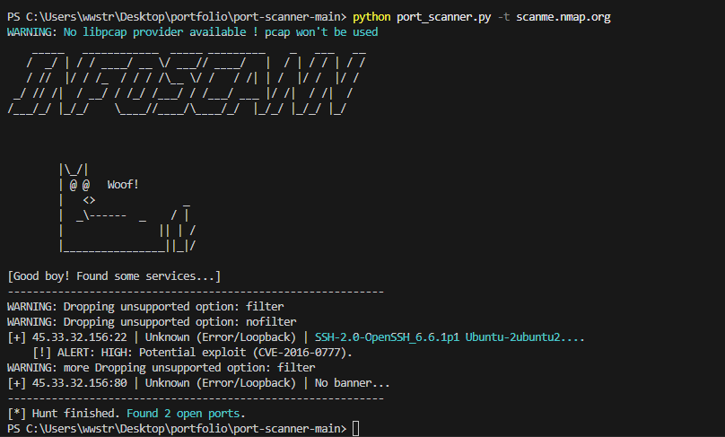

# InfoScann 


**InfoScann** is a fast, modular, and concurrent network port scanner built entirely in Python.

I designed this project to perform effective network reconnaissance tasks—like banner grabbing and OS fingerprinting—by leveraging an asynchronous parallelism model and low-level raw packet manipulation.

## How It Works Under the Hood

The core logic of the scanner (`port_scanner.py`) is broken down into these phases for each analyzed port:

1. **Parallelism**: To ensure the tool is fast when scanning multiple IP addresses and ports at once, I implemented Python's `concurrent.futures.ThreadPoolExecutor`. Instead of iterating port by port in a blocking loop, the program dispatches and manages a pool of threads that run tests in parallel.
2. **Port Detection** (two techniques, chosen with `-s`):
   - **Connect scan** (default, no privileges needed): a full TCP handshake with the standard `socket` library (`connect_ex`). The socket family (`AF_INET` / `AF_INET6`) follows the IP version, so IPv6 targets work too.
   - **SYN scan** (`-s syn`, needs root): a half-open scan with `scapy`. A lone SYN is sent and the reply is classified: SYN-ACK means open (and a RST is sent so the handshake never completes), RST means closed, and no reply means filtered. If the scanner lacks raw socket privileges, it warns and falls back to the connect scan.
3. **Port States**: Every port is reported as **open**, **closed** (the host answered with a RST) or **filtered** (timeout or ICMP unreachable, usually a firewall dropping the packet).
4. **Active Banner Grabbing** (connect scan): the banner is read over the same socket that detected the open port, so each open port costs a single TCP connection. On web ports (80, 443, 8080, 8443) the code sends a `HEAD / HTTP/1.1` request to force an identifiable response. On TLS ports (443, 8443) the connection is first wrapped with Python's `ssl` module (certificate verification disabled on purpose, since scanners must handle self-signed and expired certificates), and the certificate **subject, issuer and expiry date** are reported.
5. **Passive OS Fingerprinting** (SYN scan): the tool reads the Time-To-Live (TTL, or Hop Limit on IPv6) of the SYN-ACK it already received and makes an educated guess about the Operating System (e.g., TTL~64 usually points to Linux distributions, TTL~128 points to Windows). No extra packet is needed.
6. **Reporting**: results are printed live, then summarized in a table sorted by IP and port, including the registered service name (`socket.getservbyport`). Large groups of closed/filtered ports are collapsed into a "Not shown" counter, like nmap does. With `-o`, everything can be exported to JSON.

## Tech Stack & Libraries

- `socket`: Used to instantiate the lowest-level TCP/IP connections.
- `concurrent.futures`: Handles the orchestration, concurrency, and volume control of execution threads.
- `scapy`: Crafts and analyzes the raw packets of the SYN scan.
- `ssl` + `cryptography`: TLS handshake on HTTPS ports and parsing of the server certificate.
- `json`: Exports results in a format that SIEMs can ingest.
- `argparse`: Integrates command-line parameters to maintain a POSIX standard experience.
- `ipaddress`: Parses and robustly identifies single IPs and allows for the breakdown of entire subnets (CIDR blocks).
- `pyfiglet`: Added as a temporary aesthetic touch to invoke a pleasant CLI interface on startup.

## Getting Started

To get all the features of the tool working at 100%, your environment needs to be properly set up:

**Prerequisites:**
- **Python 3.8** or higher.
- The default connect scan needs **no special privileges**.
- The SYN scan (`-s syn`) and OS fingerprinting need raw packets:
  - **Windows:** **Npcap** installed and the console run as **Administrator** (required by Scapy).
  - **Linux / MacOS:** superuser privileges (`sudo`), or the `CAP_NET_RAW` capability.

**Installation:**
The project is packaged using `pyproject.toml`, which allows you to cleanly install it as a native system command.

```bash
# While inside the code directory, install the tool via pip:
pip install .

# Once installed, you can run it from anywhere on your system:
infoscann -t 127.0.0.1 -p 80,443
```

**Using Docker (Recommended):**
The project is automatically built and published to the GitHub Container Registry. You can run it directly without installing any local dependencies:

```bash
# Note: --privileged is required for the SYN scan and OS fingerprinting via raw sockets
docker run --privileged ghcr.io/fernando-redondo1/port-scanner:main -t scanme.nmap.org -s syn
```

## See It In Action



### Usage Modes & Examples:
The tool allows you to adapt the aggressiveness and range of the scan based on your needs:

* **Stealth Mode (Default)**
  `infoscann -t scanme.nmap.org`

* **Aggressive Mode:**
  `infoscann -t scanme.nmap.org -m aggressive`

* **Target Specific Ports:**
  `infoscann -t 127.0.0.1 -p 21,22,80,443,8080`

* **Port Ranges (can be mixed with single ports):**
  `infoscann -t 127.0.0.1 -p 1-1024`
  `infoscann -t 127.0.0.1 -p 22,80,8000-8100`

* **SYN Scan with OS Fingerprinting (needs root):**
  `sudo infoscann -t 127.0.0.1 -s syn`

* **IPv6 Target:**
  `infoscann -t ::1 -p 22,80,443`

* **Export to JSON (e.g. for SIEM ingestion):**
  `infoscann -t 127.0.0.1 -p 1-1024 -o results.json`

The JSON file contains the scan metadata (target, scan type, UTC start/end timestamps) and one record per port:

```json
{
  "ip": "127.0.0.1",
  "port": 443,
  "state": "open",
  "service": "https",
  "os": "Unknown (needs -s syn)",
  "banner": "HTTP/1.1 302 Found ...",
  "tls": {
    "subject": "CN=example.local",
    "issuer": "CN=Example CA",
    "expires": "2027-01-01T00:00:00+00:00"
  },
  "vulnerability": null
}
```

## What's New

- **One connection per open port**: the connect scan reuses the same socket for detection and banner grabbing, and no longer sends an extra packet for OS detection.
- **TLS support**: HTTPS ports are wrapped with `ssl`, and the certificate subject, issuer and expiry date are reported.
- **IPv6 support**: the socket family follows the IP version, and names are resolved with `getaddrinfo` (AAAA records included).
- **Sorted summary table**: results are ordered by IP and port at the end of the scan.
- **Closed vs. filtered ports**: RST replies and timeouts are now told apart instead of being silently ignored.
- **SYN scan** (`-s syn`): half-open scan with `scapy`, reusing the SYN-ACK TTL for OS fingerprinting, with automatic fallback to the connect scan without privileges.
- **Port ranges**: `1-1024` and mixed lists like `22,80,8000-8100`.
- **Service names**: from the OS services database via `getservbyport` (thread-safe, since the underlying C call is not).
- **JSON export** (`-o`): all results plus scan metadata.

## What's Next (Roadmap)

Done since the first version: ~~TCP SYN scan~~ and ~~TLS/SSL support~~.

I've identified a few key areas for refactoring and improvement for production environments going forward:

- **Vulnerability Scanner Scalability**: The passive vulnerability check currently reads from a constant block in memory. The natural iteration would be an asynchronous integration with standardized APIs like standard CVE databases or Vulners to provide reports against the actual ecosystem.
- **Service Detection in SYN Mode**: The SYN scan never completes a handshake, so it gets no banners. An optional follow-up probe on open ports (like nmap's `-sV`) would bring back banners, TLS details and vulnerability checks.
- **Large IPv6 Networks**: CIDR targets are expanded into a full host list, which is fine for IPv4 subnets but not for an IPv6 `/64`. Large ranges should be rejected or streamed instead.
- **Streaming Output**: An NDJSON mode (one JSON event per line, written as each port finishes) would let SIEM agents tail the file during long scans.
- **Automated Tests**: Unit tests for port parsing, state classification and the report format, run in CI before the Docker image is published.

